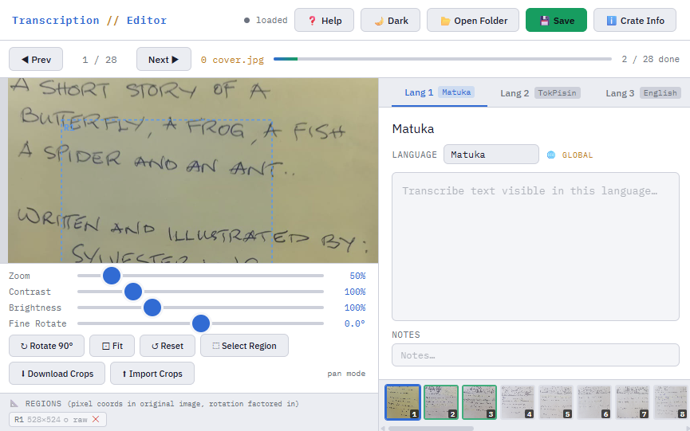

# Picture Book Transcription Editor

A single-file browser-based tool for transcribing text from historical images and marking regions of interest, with all metadata saved as a native [RO-Crate](https://www.researchobject.org/ro-crate/).

## Versions

| File | Version | What it is |
|---|---|---|
| `picture-book-transcription-editor-v03.html` | **v03 — current** | Right-side non-blocking Item Metadata panel |
| `picture-book-transcription-editor-v02.html` | v02 | Full feature set including Folder Audit |
| `picture-book-transcription-editor.html` | v01 | Original release; all core features, no audit screen |

**Use v03** unless you have a specific reason to stay on an earlier version. The files are independent — no installation, no shared state.

## What it does

Open a folder of JPEG, PNG or PDF files, transcribe the text you see in up to three languages per image, draw bounding boxes around areas of interest (stamps, seals, drawings), and export or import edited crops. Everything is tracked in a standard `ro-crate-metadata.json` file written directly into your project folder.

## Getting started

1. Open `picture-book-transcription-editor-v03.html` in **Google Chrome** or **Microsoft Edge** (version 86 or later).
2. Click **Open Folder** and select the folder containing your images or PDFs.
   - PDFs are split into one JPEG per page automatically (requires an internet connection the first time, to load the PDF.js library).
   - If a `ro-crate-metadata.json` already exists in the folder, the **Folder Audit** screen appears (see below) so you can catch any files added since the last session.
3. Transcribe, annotate, and save.

> Firefox and Safari can open the tool and edit text, but cannot write files directly — you would need to copy the generated JSON manually.

## Features

### Image viewer
- **Zoom** (10–400 %), **Contrast**, **Brightness**, and **Fine Rotate** (±45°) sliders so you can make faded or skewed text legible without altering the source file.
- **Rotate 90°** for images captured sideways.
- **Pan** by clicking and dragging anywhere on the image; scroll wheel zooms.
- **Fit** button to reset the view.
- **Dark / Light theme** toggle in the toolbar.

### Transcription
- Three language tabs per image, each with a language field. Language is global — set once and applied to all images.
- A free-text **Notes** field per language for uncertain readings or editorial comments.
- **Stacked view** toggle to see all three languages at once.
- Thumbnail strip at the bottom for quick navigation; completed images are highlighted in green.

### Region selection and crops
- Click **Select Region**, then drag a rectangle on the image to mark an area. The crop is saved immediately as a JPEG in your project folder.
- Click a region tag to highlight its bounding box; click **✕** on a tag to delete the region and remove the file.
- **Download Crops** exports all regions across all images as a flat ZIP of JPEGs for editing in any image editor.
- **Import Crops** re-imports a folder of edited files, matching them by their embedded ID. Edited regions are shown with a green **✓ edited** indicator.

### Metadata
- **Item Metadata** dialog captures archival fields: identifier, title, description, content language, subject language, country, origination date, region, original media, data categories, discourse type, dialect, people & roles, and license.
- Supported licenses: CC BY 4.0, CC BY-SA 4.0, CC BY-NC 4.0, CC0 1.0, or custom.

### Saving
- Metadata is saved automatically on navigation and after a short typing pause.
- Press **Ctrl+S** or click **Save** for an immediate write.
- A status indicator (dot + label) shows whether the file is up to date or has unsaved changes.

### RO-Crate output
All data is written to `ro-crate-metadata.json` in the open [RO-Crate 1.1/1.2](https://www.researchobject.org/ro-crate/) format. The file records every image, transcription, region, crop and edited file with full provenance. It can be read by any RO-Crate-compatible tool and shared or archived alongside the images.

---

## What's new in v03

### Item Metadata panel opens on the right
The **ℹ️ Crate Info** / Item Metadata dialog no longer opens as a centred modal with a darkened overlay. Instead it slides in as a panel anchored to the right side of the screen:

- The background is **not dimmed**, so the image panel on the left remains fully visible and usable while the form is open.
- Clicks on the image or any other part of the interface **pass straight through** — you can pan, zoom, and read the image without closing the panel first.
- Close the panel with the **✕ Close** button or by saving.

## What's new in v02

### Folder Audit screen
When you reopen a folder that already has a `ro-crate-metadata.json`, v02 shows a **Folder Audit** screen before entering the editor. It lists every file in the folder and flags anything that's missing from the existing crate — useful when new images have been added to the folder between sessions.

Each file in the audit list shows its type (image, PDF, crop, system, data), its crate status, and an action if relevant:

| File type | Status badges | Action |
|---|---|---|
| Images / PDFs already in crate | ✓ in RO-Crate (green) | — |
| Images / PDFs not yet in crate | ✕ new file (amber) | **+ Open** — adds to editor and saves |
| Other data files not in crate | not in crate (dim) | **Register** — adds as `hasPart` entity in crate |
| Crop files, `ro-crate-metadata.json` | system / crop (dim) | — |

**+ Add all missing** in the header adds every untracked image/PDF at once.  
**Continue to Editor →** skips the audit and goes straight to the editor.

### Registered data files
Via the Folder Audit screen, arbitrary non-image files (PDFs, audio, spreadsheets, etc.) can be **registered** into the RO-Crate as bare `hasPart` file entities. This allows a project folder containing mixed-type materials to produce a complete crate manifest.

---

## Keyboard shortcuts

| Key | Action |
|---|---|
| `← →` | Previous / next image |
| `1` `2` `3` | Switch language tab |
| `Ctrl+S` | Save RO-Crate |
| `Esc` | Exit region draw mode |
| Scroll wheel | Zoom in / out |
| Click + drag | Pan image (pan mode) |

## Browser requirement

Requires **Chrome or Edge 86+** for the [File System Access API](https://developer.mozilla.org/en-US/docs/Web/API/File_System_API) used to read and write files directly. No server, no install, no data leaves your machine.

## No dependencies to install

Everything runs client-side. The only external resources loaded are:
- [IBM Plex fonts](https://fonts.google.com/specimen/IBM+Plex+Mono) (Google Fonts, for the UI)
- [PDF.js](https://mozilla.github.io/pdf.js/) (loaded on demand when a PDF is opened)
- [JSZip](https://stuk.github.io/jszip/) (loaded on demand when downloading crops as a ZIP)
